# Blurred motion from ray to path tracing

## Entry 1: Simple ray casting with shadows

This project begins with re-implementing the ray tracer we made in Lab 2 from scratch in a more object-oriented manner.

This method uses Lambert's cosine law (Lambertian reflectance).

The light intensity is determined by the following equation:

> Intensity = Ambient term + Diffuse reflection constant (element-wise product with) the sum of the intensity of all light sources

where the Diffuse reflection constant is the color of the surface, and the intensity of each light is given by: 

> Differential irradiance * geometry

Geometry: 1 if unobstructed, 0 if in shadow

The differential irradiance is

> dE = Power * (Normal dot LightDirection) / 4 pi r^2

For unit vectors, this is equivalent to

> dE = Power * cos(theta) / 4 pi r^2

This yields the following result, equivalent to Lab 2:

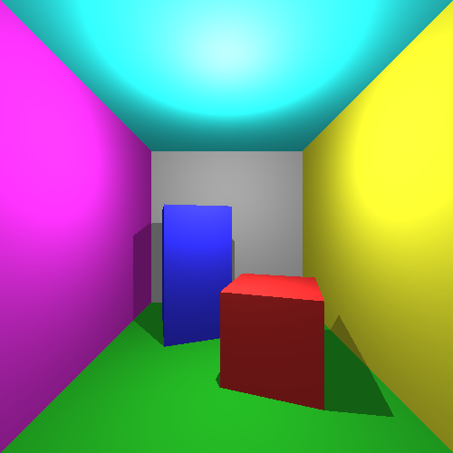

## Entry 2: Whitted-style recursive ray tracing

Whitted-style ray tracing was introduced by (perhaps unsurprisingly) Turner Whitted in his paper "An Improved Illumination Model for Shaded Display" (1980).

This method extends the light intensity using two recursive terms. The intensity is now:

> Intensity = Lambertian + Specular + Transmissive

where Specular is the light intensity arriving at the surface from the reflected direction, and Transmissive is the light intensity arriving from through the surface. This direction is determined using an index of refraction.

This lets us create materials such as mirrors.

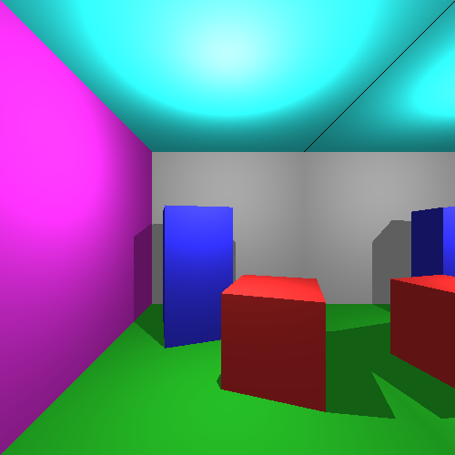

We can also have materials refract light. I don't know enough about refraction to determine whether this is accurate. But refraction is not a focus of this project, and the cube looks cool.

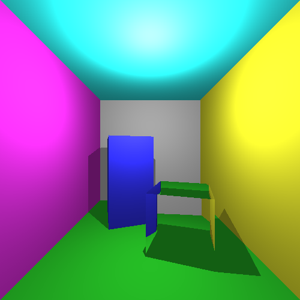

I also implemented a sphere shape. Solving ray-sphere intersection is a (simple-ish) quadratic equation. It has up to two solutions since the ray can both enter and exit the sphere, thus hitting the shell twice.

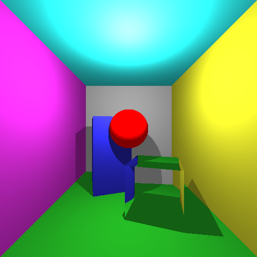

## Entry 3: Distributed ray tracing

Distributed ray tracing (now sometimes known as distribution ray tracing) was introduced by Robert Cook et al. in the aptly named paper "Distributed ray tracing" from 1984.

In Whitted-style ray tracing, we sent 1 ray for each pixel, which spawned 3 rays (light source, reflection, refraction). In distributed ray tracing (also known as distribution ray tracing), we send multiple rays for each pixel, distributed over some domain, and average the result. 

The traditional domain is the spatial domain. By sampling different exact points on each pixel, and averaging them, we can avoid aliasing artifacts (jagged edges). But Cook et al. proposed numerous phenomena that can be rendered in the same way, by sampling different domains. Sampling in time gives motion blur. Sampling over the camera lens can give depth of field. Sampling on the light source can give soft shadows. Both reflections and transmitted light can also be sampled.

For now, I am going to implement depth of field and the main focus of this project: motion blur. Both of these are also relatively simple to implement.

In the pinhole camera model, we essentially send a ray from the film through the center of the lens (the "eye"). Each point in the world corresponds to a point on the film. With a lens, only those things on the plane of focus will correspond to a single point on the film. Other things will have a "circle of confusion" on the film from which it can be "seen". 

Cook et al. showed that we can sample this circle of confusion through the following process: send a ray from the point on the film through the center of the lens as normal. Determine the point on this ray that lies on the plane of focus. Then sample a point on the lens and send a ray from this point to the point on the plane of focus. This will yield a sample of that point on the film. Repeat and take the average.

For motion blur, we distribute the rays over the period of time the shutter is open and average the result. To do this, we need to be able to calculate an object's position at a given time. In addition, to put the motion in motion blur, we also need some objects whose position depends on the time.

For this next image, the camera has been focused on the middle of the Cornell box. The red sphere has a slight animation from right to left. This image has 16 samples per pixel. More samples would reduce noise.

Note how the blue block is in focus, while the moving red sphere isn't. But notice the jagged edge on the bottom edge of the blue block, since we have not implemented spatial sampling yet. We are already sending multiple samples per pixel, so we can remove this "for free" by random distributing each ray origin over the entire size of the pixel.

Technically, the aliasing isn't removed, but transformed into noise. With enough samples, that noise becomes imperceptible. The jagged edge is basically gone. The black around the edge of the image is due to bleed from the background, which is normally just outside of the bounds of the image. The more samples, the less noise. Below is the same image but rendered with 128 samples per pixel. It took 70 minutes to render.

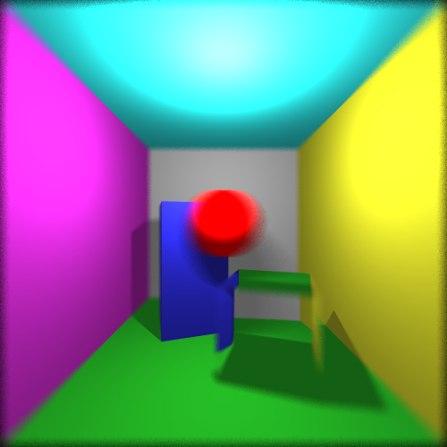

## Entry 4: Path tracing

Distributed ray tracing is great, and the results speak for themselves. However, the next step in our motion blur journey is to move away from point lights and towards emissive lights, i.e. shapes in the scene that emit lights. Instead of an infinitesimally small (invisible) source of light, I would like an object (like a sphere) that is visible and can be motion blurred. 

The problem is that non-point lights should result in soft shadows. With point lights, a point is either visible or not visible from the light source. But when lights have an area, the brightness depends on how much of the light source is visible. This is technically possible to achieve in distributed ray tracing, but the correct approach would be to trace rays to the light source in such a way that the number of rays traced to any location on the light is proportional to the intensity and projected area of that location from the perspective of the surface. That sounds hard. It is hard.

Distributed ray tracing also does not correctly handle ambient light. Since it is merely an extension of Whitted ray tracing, which uses Lambertian illumination, we still have a flat ambient term to brighten up the shadows. That's not good enough. The motion blur and depth of field is nice, though. Is there perhaps a method which improves upon distributed ray tracing?

In fact, yes! Only two years after the work by Cook et al., James Kajiya published "The rendering equation" (1986). Besides generalizing most rendering techniques into approximations of a single equation, he also introduced the path tracing method. Instead of sending out new rays on each surface hit, it randomly chooses a new direction according to the BRDF of the hit surface. If such a series of rays (a path) happens to hit an emissive object, i.e. a light, then that light is carried through the path back to the camera and the associated pixel. 

We can actually shoot rays however we want, as long as each ray is weighted according to the actual probability of obtaining that ray. Whereas distributed ray tracing relied on the distribution of rays, in path tracing, a better distribution simply means a faster convergence. The result isn't biased by the distribution.

Path tracing also allows us to have more complex materials, since we can adjust the BRDF as we please. However, some materials are more problematic: mirrors and perfectly refracting materials, like we saw in Whitted ray tracing, aren't as simple. Since the scattering is random, the probability of getting a ray on the perfect mirror axis is zero. Such "extreme" materials require specialized handling, but are not critical to seeing motion blur, so I won't go into it.

Diffuse materials are easiest, so we can immediately see the benefits of this method by taking the colorful Cornell box and adding our moving red sphere and a huge spherical light source at the same location as the point light used to be.

The problem with path tracing is that since we now have random distributions in every single bounce (before it was only in the motion and depth of field), the image has a lot more noise. We need a LOT of samples to get a good result. Note however that each sample is faster to obtain than in distributed ray tracing, since we aren't spawning additional rays on every bounce.

This image uses 256 samples per pixel and took about an hour.

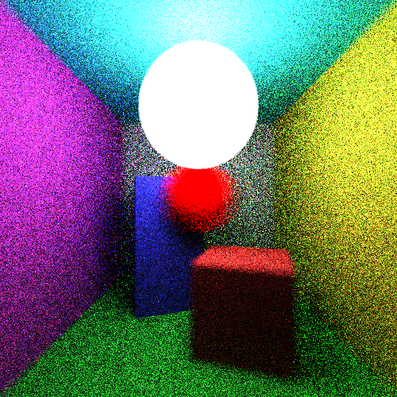

The above method used a naive distribution of the rays (spherical with respect to the normal direction). Below is the same image, rendered with the same number of samples, using a better distribution (cosine-weighted hemisphere distribution):

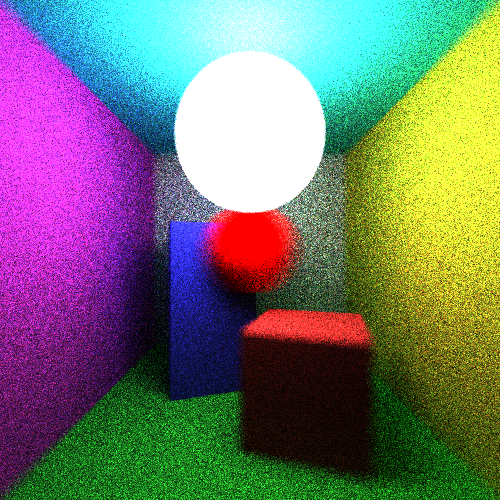

The distribution is quite important. First of all, all directions that are relevant to the brightness of the surface should be sampled (for perfectly diffuse materials, we should consider all possible directions out from the surface). Second, we need to know what distribution we're dealing with, so that frequently sampled directions aren't given too much weight. Below is what happened when a typo meant I accidentally violated both of these principles.

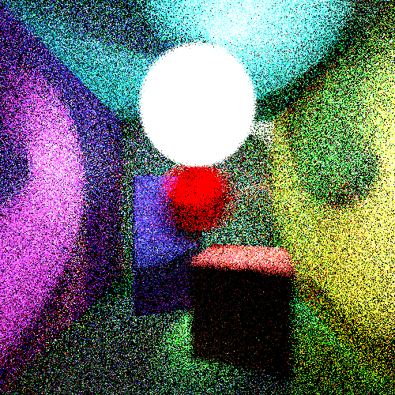

## Entry 5: Beyond the blur

Motion blur isn't very interesting without interesting motions. So let's fix that.

Below is a spiralling light source, because why not?

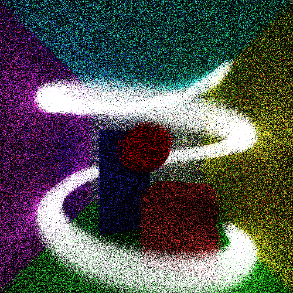

Note how there is a lot more noise in the scene. Path tracing works best with large light sources, since the paths have to actually find their way to the light source. The above scene only has a small spherical light source, giving limited light at each point in time.

To brighten things up, we can add back our large center lamp.

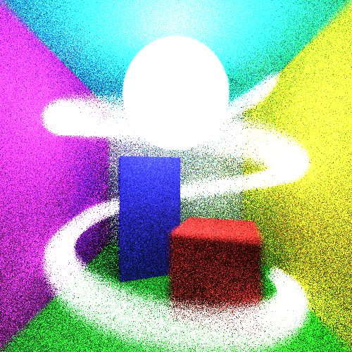

That's better.

Interestingly, the above image also had a red sphere spiralling in tandem with the light source. Did you miss it?

The red sphere disappears because the background dominates over the samples. The contribution by the red (non-emissive) sphere to each pixel is so small when you consider the entire shutter time. Hence, it basically becomes invisible. The same thing happens in real photographs. Sufficiently strong emissive lights can, however, dominate the image even if they are spread out over their path of motion.

Next, let's move the camera as well! Below is an image rendered with a moving red sphere where the camera also moves to follow it in parallel. Now, it remains sharp while everything else in the scene is blurred. That places immense emphasis on the moving subject, which is quite striking.

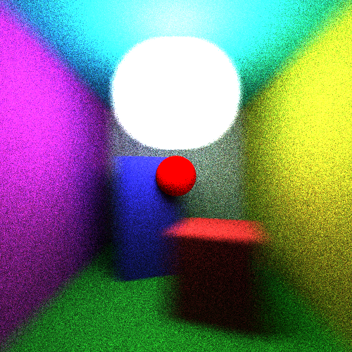
